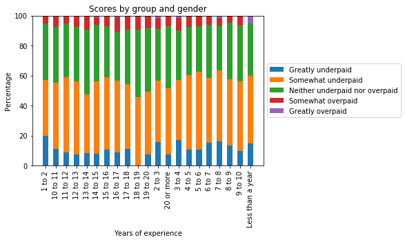
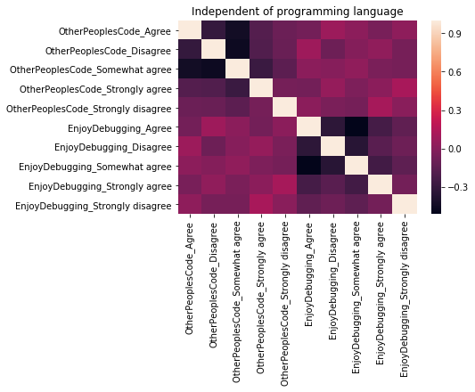
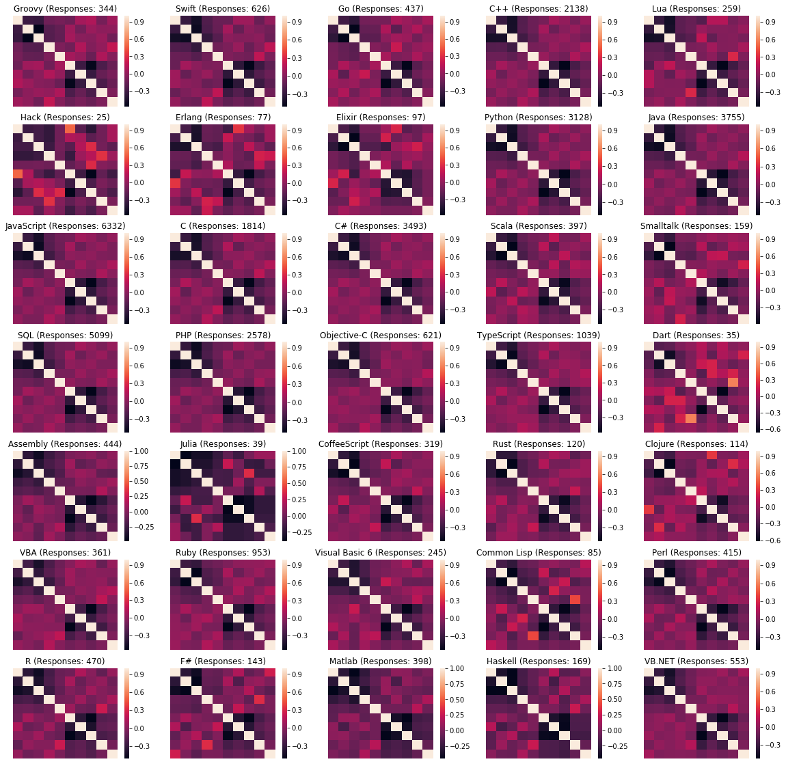

# Stackoverflow Survey 2017
> TL;DR: Have a look at the last table to get the results of this analysis. 

Stackoverflow performs an anual survey. As stackoverflow is used by many developers, it is "the largest and most comprehensive survey of people who code around the world" [1](https://insights.stackoverflow.com/survey/). 
The survey covers a wide range of topics. From the technologies used to production blockers to working conditions, everything is covered.

As the data is so broad, in the following part, only the used data columns are mentioned and explained if needed.

**Questions which will be answered in the following parts:**

To get an idea of this huge data set, I had a look into the schema file which is provided additionally. In the following text I would like to answer some questions which came to me while looking at the data. These questions refer to the people behind the accounts, not to Stackoverflow relevant evaluation. Here are my questions:  

|#| Question | Helpful columns |
| ---| :--- | :---|
|1| Exists a correlation between *Overpaid* and the programming experience? | YearsProgram, Overpaid |
|2| Is there a programing language specific correlation between "OtherPeoplesCode - Maintaining other people's code is a form of torture" and "EnjoyDebugging -I enjoy debugging code"? | HaveWorkedLanguage, OtherPeoplesCode, EnjoyDebugging |
|3|How many people, who program in Python, follow the PEP8 guidelines and use spaces instead of tabs?|HaveWorkedLanguage, TabsSpaces |

## Question 1: Exists a correlation between *Overpaid* and the programming experience?
### Preprocessing
To determine a correlation, you need values in the corresponding columns. Therefore, in the first step, all data records were removed where the entry in *Overpaid* was missing. By this step, the number of responses reduced from *19102* to *5184*.

*YearsProgram* is a categorical value, which define a time spans of one year each. These values are converted into a nested dictionary which match the years of experience with the Overpaid rate as it can be seen below. 
 ``` Python
## YEARS PROGRAM
# Create a nested dictionary which matches the years of experience with the overpaid rate
q1_dict_experience = defaultdict(dict)

for key, data in df_q1.groupby(by=['YearsProgram', 'Overpaid']):
    experience = key[0]
    overpaid_target = key[1]
    value = data.YearsProgram.count()
    q1_dict_experience[experience][overpaid_target] = value
 ```

### Analysis
To get comparable values for each time span, the values are calculated as percentage.
As it can be seen in the following figure, no correlation exists between the feeling of beeing Over- or Underpaid with the years of experience.



## Question 2: Is there a programing language specific correlation between "OtherPeoplesCode - Maintaining other people's code is a form of torture" and "EnjoyDebugging -I enjoy debugging code"?
### Preprocessing
In the stackoverflow data set exists a column *HaveWorkedLanguage* containing is a list of the different programming languages a respondent has been working with already. This list has been split into binary columns for each programming language. This preprocessing step can be found [here](../notebooks/Stackoverflow_Survey_2017.ipynb#Clean)

For the other columns *OtherPeopleCode* and *EnjoyDebugging* one-hot-encoding, as shown below, was performed.

``` Python
# ENJOY DEBUGGING
tmp = pd.get_dummies(df_q2.EnjoyDebugging, prefix='EnjoyDebugging', prefix_sep='_')
df_q2[tmp.columns] = tmp
df_q2 = df_q2.drop(labels=['EnjoyDebugging'], axis = 1)
```
### Modelling
My assumption is that someone who likes to debug and fix code, might also be interessted in understanding other peoples code as he does it often when searching for solutions. To test my assumption, I generated a correlation matrix between the two columns.



The interesting parts of the figure are the upper right and lower left quadrant. The two other quadrants show the correlation between all possible values for *OtherPeopleCode* with them self.
As it can be seen there is no strong correlation between the two features.

Some programming languages are harder to read and understand than other, so I recomputed the correlation matrix for each available programming language.


For some programming languages, there are some small identications agreeing or disagreeing with my assumption but not as clear as I thought it would be. To get an idea how **aussagekräftig** the values are, I added the number of responses which were available for each language.


## Question 3: How many people, who program in Python, follow the PEP8 guidelines and use spaces instead of tabs?
### Preprocessing
As I write most of the time in Python, I was curious how many of the users use Spaces for indentation as it is proposed in the PEP8 guidelines.

For this analysis, only two columns are needed: *Python* and *TabsSpaces*. The column *Python* has been generated as described in the preprocessing of Question 2. The column *TabsSpaces* has been converted into three binary columns, one for Tabs, one for Spaces and one for users who use both.
### Analysis
For the analysis, some calculations have been made. Here are the results: 
- 2119 Stackoverflow users who programm in Python use Spaces, as it is suggested by the PEP8 guidelines. This are 50.46% of all python users in this survey.
- 1457 of the survey participants which programm in Python have not heard about PEP8 yet and use tabs for indentation. Hopefully this number will decrease.
- Only 14.57% of the Python programmers write a mixture of tabs and spaces. If they are only programming Python, this means that they use Python 2, because Python 3 does not allow a mixing of tabs and spaces anymore. Or they use different programming languages and this leds to this unambigous answer.

## Which questions have been answered with this analysis?
|#| Question | Answer |
| ---| :--- | :---|
|1| Exists a correlation between *Overpaid* and the programming experience? | No, the impression of the respondent if they are over- or underpaid is not strongly influenced by their programming experience.|
|2| Is there a programing language specific correlation between "OtherPeoplesCode - Maintaining other people's code is a form of torture" and "EnjoyDebugging -I enjoy debugging code"? | No clear correlation could be found between *OtherPeoplesCode* and *EnjoyDebugging*. There are language specific changes, but nothing extraordinary. |
|3|How many people, who program in Python, follow the PEP8 guidelines and use spaces instead of tabs?| 50.46% of all python users in this survey use spaces as it is suggested by the PEP8 pipelines.|

The implementation for this analysis can be found [here](../notebooks/Stackoverflow_Survey_2017.ipynb).